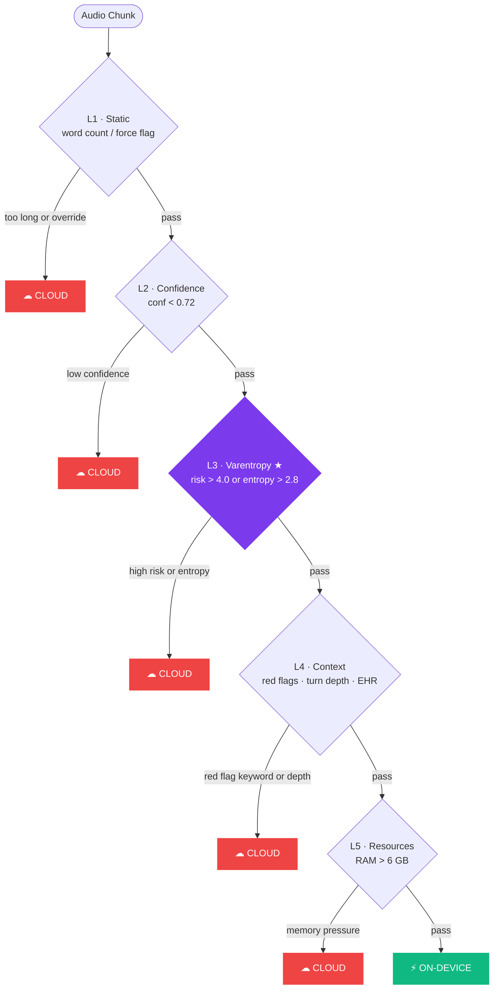

# Doccy Co-pilot

> A real-time AI second opinion for doctors during live patient consultations — running on-device with surgical cloud escalation.

---

## What We Built

Doccy Co-pilot listens to a doctor-patient consultation through the device microphone and, in real time, provides the clinician with:

- **Live entity extraction** — symptoms, drugs, body parts, red flags, and timelines pulled from speech as it happens
- **Differential diagnosis** — ranked candidate diagnoses with ICD-10 codes, likelihood scores, and clinical rationale, updated every time a new symptom is detected
- **EHR contradiction detection** — catches when what the patient says conflicts with what's on record (allergy discrepancies, undisclosed medications, lab correlations)
- **Drug interaction alerts** — cross-references newly mentioned drugs against the patient's active medication list in real time
- **Suggested questions** — the model identifies the single most useful question the doctor should ask next to disambiguate the top differential; spoken aloud via TTS and queued on-screen
- **Flagged lab panel** — surfaces the patient's abnormal EHR labs at a glance (HbA1c HIGH, eGFR LOW, BNP HIGH, etc.) so the doctor never has to tab away
- **Session summary** — on consultation end, generates a full SOAP note, ranked differentials, and suggested labs/imaging

All heavy inference runs on-device (Gemma 4 E2B via the Cactus SDK). Cloud is called only when the routing system decides it must be — never by default.

---

## System Architecture

```
┌─────────────────────────────────────────────────────────────────┐
│                        Live Consultation                        │
│              Doctor ◄──────────────────► Patient                │
└───────────────────────────┬─────────────────────────────────────┘
                            │ audio (16 kHz PCM)
                            ▼
              ┌─────────────────────────┐
              │      Silero VAD         │  speech boundary detection
              │  512-sample frames      │  seals chunks: 0.3 – 8.0 s
              └────────────┬────────────┘
                           │ sealed audio chunk
                           ▼
              ┌─────────────────────────┐
              │  Cactus / Gemma 4 E2B   │  multimodal on-device LLM
              │  Audio + text extract   │  output: transcript,
              │  model_lock (Lock)      │  symptoms, drugs,
              │  _MAX_TOKENS = 120      │  body_parts, red_flags
              └────────────┬────────────┘
                           │ entities + transcript
                           ▼
              ┌─────────────────────────┐
              │   Rule Engine (3 paths) │
              │  ├─ check_alerts()      │  10 red-flag rules
              │  ├─ check_contradic()   │  EHR vs. spoken diff
              │  └─ check_drug_ent()    │  15 DDI pairs
              └────────────┬────────────┘
                           │
                           ▼
              ┌─────────────────────────┐
              │  6-Layer Router         │  < 1 ms decision
              └───────┬─────────────────┘
                      │
          ┌───────────┴────────────┐
          │                        │
          ▼                        ▼
  ⚡ ON-DEVICE               ☁ CLOUD
  Cactus text-only       Gemini 2.5 Flash
  differential           differential
  model_lock             anonymised context
  200 token cap          circuit-breaker
          │                        │
          └───────────┬────────────┘
                      │ differential result
                      ▼
              ┌─────────────────────────┐
              │  WebSocket Broadcast    │  11 event types
              │  FastAPI / asyncio      │  to all connected clients
              └────────────┬────────────┘
                           │ suggested_question
                           ▼
              ┌─────────────────────────┐
              │  OpenAI TTS (tts-1)     │  spoken aloud, non-blocking
              │  streaming PCM          │  sounddevice.RawOutputStream
              └─────────────────────────┘
```

---

## 6-Layer Intelligent Routing

The central engineering problem: **when should we trust on-device inference, and when must we call the cloud?**

A naive confidence threshold isn't enough. A model can be *confidently wrong*. We built a layered gate system that reads multiple independent signals — from token-level probability distributions to device memory — and makes a routing decision in under 1 ms.

### Decision flow

```
Audio chunk arrives
        │
        ▼
┌───────────────────────────────────────────────────┐
│  L1  Static heuristics                            │
│      prompt word count > 80?  → ☁ CLOUD           │
│      force_cloud flag set?    → ☁ CLOUD           │
└──────────────────────┬────────────────────────────┘
                       │ pass
                       ▼
┌───────────────────────────────────────────────────┐
│  L2  Heuristic confidence gate                    │
│      Cactus returns a native confidence float     │
│      with every completion.  If Cactus itself     │
│      says it's uncertain, stop here.              │
│      confidence < 0.72  → ☁ CLOUD                 │
└──────────────────────┬────────────────────────────┘
                       │ pass
                       ▼
┌───────────────────────────────────────────────────┐
│  L3  ★ Varentropy math gate  (see below)          │
│      Computed from token logprobs.                │
│      risk > 4.0     → ☁ CLOUD                     │
│      entropy > 2.8  → ☁ CLOUD                     │
└──────────────────────┬────────────────────────────┘
                       │ pass
                       ▼
┌───────────────────────────────────────────────────┐
│  L4  Conversation context                         │
│      Medical red flag keyword in transcript?      │
│        "chest pain", "stroke", "anaphylaxis" …    │
│        → ☁ CLOUD (always, regardless of conf.)    │
│      Red flags extracted by Gemma 4?              │
│        → ☁ CLOUD                                  │
│      Turn depth > 30?  (KV cache pressure)        │
│        → ☁ CLOUD                                  │
│      EHR not loaded + conversation deep?          │
│        → ☁ CLOUD                                  │
└──────────────────────┬────────────────────────────┘
                       │ pass
                       ▼
┌───────────────────────────────────────────────────┐
│  L5  Resource gate                                │
│      Cactus reports ram_usage_mb per completion.  │
│      If device is under memory pressure,          │
│      escalate before it crashes.                  │
│      RAM > 6000 MB  → ☁ CLOUD                    │
└──────────────────────┬────────────────────────────┘
                       │ pass
                       ▼
┌───────────────────────────────────────────────────┐
│  L6  On-device confirmed  ✓                       │
│      All signals green → ⚡ ON-DEVICE              │
└───────────────────────────────────────────────────┘
```

### Mermaid diagram



---

## ★ Varentropy — Detecting Hallucination from Token Distributions

> If you want the truth, stop reading the output text and start reading the logprobs.

Logprobs are the raw, normalised log-probabilities of each token the model selected. They expose something the output text hides: *how certain was the model, token by token?*

### The problem with entropy alone

Standard entropy is the average uncertainty across tokens. It tells you the model's *mean* state. What it misses is **oscillation** — when the model alternates between very high and very low confidence from one token to the next.

That oscillation is the statistical fingerprint of confabulation. The model commits confidently to some tokens, then loses its footing on others, then recovers — producing fluent-sounding output that is partly grounded and partly invented.

### Varentropy catches it

```
Token stream:   [t₁]   [t₂]   [t₃]   [t₄]   [t₅]   [t₆]   [t₇]   [t₈]

Logprobs:      -0.05  -0.08  -2.91  -0.06  -3.14  -0.07  -2.88  -0.05
                 │             │             │             │
              certain       SPIKE         SPIKE         SPIKE
                ▲                                         ▲
         high certainty                           high certainty

Entropy   ≈ 0.9   ← looks acceptable on average
Varentropy ≈ 1.8  ← variance is HIGH → model is oscillating → CLOUD
```

Entropy alone would accept this sequence. Varentropy catches it.

### The formula

```
logprobs = [lp₁, lp₂, …, lpₙ]        # one per decoded token (from Cactus)

probs[i]   = exp(lp[i])               # convert back to probabilities
neg_lp[i]  = -lp[i]                   # negate (entropy convention)

entropy    = −Σ probs[i] × lp[i]      # average uncertainty (Shannon)
varentropy = Var(neg_lp)              # ← variance of per-token uncertainty

raw_risk   = mean(neg_lp) + λ × varentropy    # λ = 2.0  (tuned)
risk       = raw_risk / log(n + 1)             # normalise by sequence length
```

The `λ` weight on varentropy (2.0) was tuned to balance sensitivity to oscillation against false positives on naturally variable clinical vocabulary. Length normalisation prevents longer sequences from accumulating artificially high risk scores.

### Implementation

```python
def _varentropy(logprobs: list, risk_lambda: float = 2.0) -> dict:
    lp      = np.array(logprobs, dtype=np.float64)
    probs   = np.exp(lp)
    neg_lp  = -lp

    entropy  = float(-np.sum(probs * lp))     # Shannon entropy
    varentr  = float(np.var(neg_lp))          # ← the innovation
    ev       = float(np.mean(neg_lp))
    raw_risk = ev + risk_lambda * varentr

    norm = float(np.log(len(logprobs) + 1))   # length normalisation
    risk = raw_risk / norm if norm > 0 else raw_risk

    return {
        "entropy":    round(entropy, 4),
        "varentropy": round(varentr, 4),
        "risk":       round(risk, 4),
        "n_tokens":   len(logprobs),
    }
```

### Routing thresholds

| Signal | Threshold | Trigger |
|--------|-----------|---------|
| `risk` | > 4.0 | Escalate to cloud |
| `entropy` | > 2.8 | Escalate to cloud |

Both are independently sufficient. A sequence that passes the risk ceiling but exceeds raw entropy is still escalated — they catch different failure modes.

---

## Evaluation System

Every audio chunk that passes through the pipeline is fully instrumented. The `/stats` REST endpoint and the live `stats` WebSocket event expose real-time telemetry.

### Routing telemetry

```json
{
  "routing": {
    "chunks_total": 47,
    "chunks_dropped": 2,
    "local_only": 39,
    "escalated_cloud": 8,
    "cloud_pct": 17.0,
    "reasons": {
      "all_layers_passed": 39,
      "low_confidence(0.58)": 4,
      "red_flag:'chest pain'": 2,
      "varentropy_risk(4.31)": 2
    }
  }
}
```

### Latency telemetry

```json
{
  "timing_ms": {
    "queue_wait": { "avg": 48,   "p95": 180  },
    "inference":  { "avg": 920,  "p95": 2100 },
    "dispatch":   { "avg": 3,    "p95": 12   },
    "cloud":      { "avg": 1840, "p95": 3200 },
    "end_to_end": { "avg": 968,  "p95": 2280 }
  }
}
```

### What we measure

| Metric | How |
|--------|-----|
| On-device vs cloud split | `cloud_pct` per session |
| Per-layer escalation breakdown | `reasons` dict, keyed by exact trigger string |
| Inference latency (avg, p95, last-5) | wall-clock around Cactus executor call |
| Queue wait | time from VAD seal to pipeline pickup — chunks > 6 s dropped as stale |
| Cloud round-trip | wall-clock around Gemini async call |
| End-to-end latency | queue_wait + inference, p95 |
| Routing decision time | logged per-call in ms |

Every routing decision is logged verbatim:

```
[ROUTING] L3 → CLOUD | varentropy_risk(4.31) | router=0.4ms
[ROUTING] L6 → ON_DEVICE | all_layers_passed | router=0.3ms
[ROUTING] L4 → CLOUD | red_flag:'chest pain' | router=0.2ms
[ROUTING] L2 → CLOUD | low_confidence(0.58) | router=0.1ms
```

---

## Pipeline Latency Budget

```
  0 ms ── VAD seals chunk
          │
 ~50 ms ── Chunk picked up from queue (avg wait)
          │
~920 ms ── Gemma 4 extraction complete
          │  (120-token cap, model_lock held for full decode)
          │
~923 ms ── Entities + transcript broadcast to frontend (≈3 ms dispatch)
          │
~924 ms ── Routing decision (< 1 ms)
          │
          ├── IF on-device differential triggered:
          │   ~1800 ms ── Cactus text-only differential complete
          │               (200-token cap, model_lock re-acquired)
          │
          └── IF cloud differential triggered:
              ~2800 ms ── Gemini 2.5 Flash responds
                          (async, does not block next chunk)
```

---

## Key Design Decisions

**Single model lock, no queue.** Both audio extraction and text-only differential share one `threading.Lock`. They serialise naturally. The simpler design avoids deadlocks and starvation.

**Stale chunk dropping.** If a chunk waited more than 6 seconds in the queue, it is discarded. The doctor already moved on; a stale differential would introduce confusion, not value.

**De-bounce on differentials.** The `_local_diff_running` flag prevents stacked differential calls. If a new symptom arrives while a differential is computing, it is silently dropped — the next symptom triggers the next differential.

**Anonymised cloud calls.** Patient name, DOB, and identifier never leave the device. Only clinical context (age, sex, diagnoses, flagged labs, current session entities) travels to Gemini.

**Circuit breaker on cloud.** If Gemini returns HTTP 429 (quota), the circuit opens for 120 seconds. All cloud calls are suppressed and the on-device path is forced for that window.

**Minimum symptom gate.** Differential diagnosis does not fire until at least 3 distinct symptoms have been accumulated. Prevents premature and unhelpful one-symptom differentials.

---

## Tech Stack

| Component | Technology |
|-----------|-----------|
| On-device LLM | Gemma 4 E2B via Cactus SDK (Python FFI → `libcactus.dylib`) |
| Cloud LLM | Gemini 2.5 Flash |
| VAD | Silero VAD (PyTorch, 512-sample frames @ 16 kHz) |
| Backend | FastAPI + asyncio, WebSocket broadcast |
| EHR | JSON patient records, Pydantic models |
| TTS | OpenAI `tts-1`, streaming PCM via `sounddevice.RawOutputStream` |
| Frontend | React + Tailwind CSS, WebSocket hook with exponential backoff |
| Routing math | NumPy (varentropy, entropy, synthetic logprob proxy) |
| JSON repair | `json_repair` for malformed LLM output |

---

## Running

```bash
# Backend
cd doccy-backend
pip install -r requirements.txt
uvicorn main:app

# Frontend
cd doccy-frontend
npm install
npm run dev
```

The WebSocket connects automatically at `ws://localhost:8000/ws`. Gemma 4 is downloaded and loaded on first startup — subsequent launches use the cached model.
